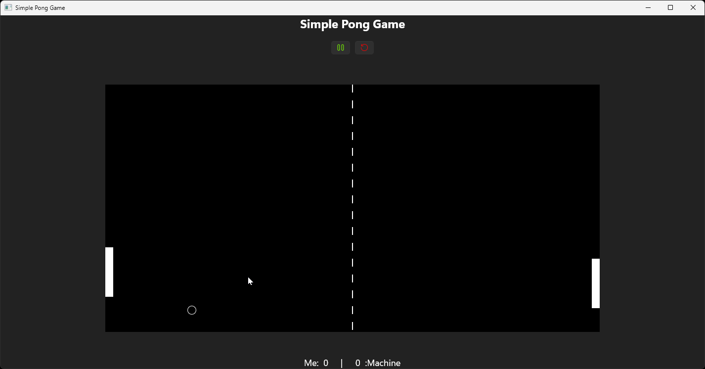

# PongGame
Simple Pong Game implemented in C# Using WinUI 3
[!Simple Pong Game](https://github.com/MicroDevX/PongGame/releases)

## Getting Started
Prerequisites:
- Your computer must be running Windows 11, build 22621 or higher.
- Install the latest version of [Visual Studio](https://developer.microsoft.com/en-us/windows/downloads) (the free community edition is sufficient).
	- Install the WinUI 3 application development workload. with SDK 10.0.22621.0 or higher.